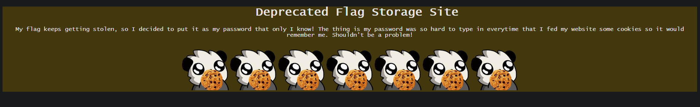

In this challenge, we are given a webiste with an image that seems to point to cookies.



On viewing the source code, we can see a js function that encrypts a plain text and sets the final encryption as a cookie.

```
function createToken(text) {
	let encrypted = "";
  for (let i = 0; i < text.length; i++) {
		encrypted += ((text[i].charCodeAt(0)-43+1337) >> 0).toString(2)
  }
  document.cookie = encrypted
}

document.cookie = "token=101100000111011000000110101110011101100000001010111110010101101111101011110111010111001110101001011101001100001011000000010101111101101011111011010011000010100101110101001101001010010111010101111110101011011111011000000110110000001101100001011010111110110110000000101011100101010100101110100110000101011101111010111000110110000010101011101001011000100110101110110101001111101010111111010101000001101011011011010100010110101110110101011011111010100010110101101101101100001011010110111110101000011101011111001010100010110101101101101100000101010011111010100111110101011011011010111000010101000010101011100101011000101110100110000"
```

They are taking each character in the plaintext and doing some sort of manipulation to the char code value.

We should be able to get the flag if we reverse this function.

For reversing this, we can take a string of all ascii characters and find what the given character manipulation would result in. After getting this, we can traverse thorugh the given binary in the cookie and find out which text would result in this binary.

```
var text = ' !"#$%&\'()*+,-./0123456789:;<=>?@ABCDEFGHIJKLMNOPQRSTUVWXYZ[\\]^_`abcdefghijklmnopqrstuvwxyz{|}~';

var flag = '101100000111011000000110101110011101100000001010111110010101101111101011110111010111001110101001011101001100001011000000010101111101101011111011010011000010100101110101001101001010010111010101111110101011011111011000000110110000001101100001011010111110110110000000101011100101010100101110100110000101011101111010111000110110000010101011101001011000100110101110110101001111101010111111010101000001101011011011010100010110101110110101011011111010100010110101101101101100001011010110111110101000011101011111001010100010110101101101101100000101010011111010100111110101011011011010111000010101000010101011100101011000101110100110000'
var flagText = ''
const encryptMap = new Map();

var temp = ''

for (let i = 0; i < text.length; i++) {
    encrypted = ((text[i].charCodeAt(0)-43+1337) >> 0).toString(2)
    encryptMap.set(encrypted, text[i])
}

for(let i = 0; i < flag.length; i++){
    temp += flag[i]
    if(encryptMap.get(temp)){
        flagText += encryptMap.get(temp)
        temp = ''
    }
        
}
```

Here we are traversing through the binary and finding the plaintext everytime a binary substring matches a plaintext from the map we created.

THis gave the final flag as ```username="roo" & password="ictf{h0p3_7ha7_wa5n7_t00_b4d}"```
