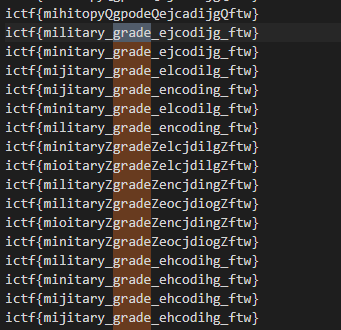

In this question, we are given a encode.py script that reads the plaintext flag and encodes it in a particular method.

On analyzing the encode script, we can see that a charset of hex characters is taken and each character is put into an array and shuffled.

After the shuffling, a map is created where each character in the hex charset is mapped to some shuffled character.

```
charset = '0123456789abcdef'
shuffled = [i for i in charset]
shuffle(shuffled)

d = {charset[i]:v for(i,v)in enumerate(shuffled)}
```
For the encoding, the hex of the flag is taken and converted to it's shuffled value from the map.
```
ct = ''.join(d[i] for i in pt.encode().hex())
```
The first solution that came to my mind was brute forcing and finding all possible permutations of the hex charset and reversing the given shuffled hex of the flag. For one such permutation, we will get the correct flag.

This method can be optimised a lot since we know the first 6 characters of the flag which is ```ictf{```

Now we can convert this into hex and find out what shuffled values each hex char is mapped to.
This eliminated 6 characters, so we only have to brute force 2^10 times.

The implemented logic is given in soln.py.
Once I got all the combinations, it was fairly easy to figure out what the correct flag is.



The flag is ```ictf{military_grade_encoding_ftw}```