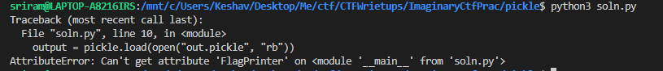

In this question, we are given a pickled file. On loading the pickle file and reading the deserialised object, we see the following output:



We can see that on unpickling the object, the soln.py file tries to access an attribute named FlagPrinter which however is not present in the file.

So we can create a class called FlagPrinter inside our soln.py file and try to read the flag value from inside the class.

When loading the pickle, all the values of the serialised object will be read, and hence when the class called FlagPrinter is invoked in our soln.py, 
the value of the variable flag will also be read.

```
class FlagPrinter():
    def __str__(self):
        print(bytes(self.flag))
```

After adding this class to our solution file, if we load the pickle and read the data, we get the flag : ```b'ictf{cucumbers_or_pickles?}'```