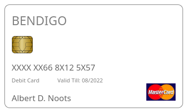

The question description had the following details:

Peter: "Welcome to Bendigo, I am Peter. How may I help you today?" Albert: "Hey! I have my bank card here, but I cannot seem to be able to read the credit card numbers on it as some of them are scratched off. I was wondering if you could tell me what they were if I could confirm my identity to you." Peter: "Ohh, unfortunatly I cannot do that. You are going to have to order a new credit card. If you requested one now, it should arrive by 2nd of August. Would you like me to do this for you?" Albert: "Hmm, unfortuately I need it sooner than that. I'll see if I can remember it in the mean time. THANKS PETER..." Peter: "See you!"

And an image of the card:

Knowing the bank name, I was able to find the first six digits of the card from list if IIN's which is publicly available. https://www.creditcardvalidator.org/mastercard/bendigo/519244

Filling the first six digits, there are two more unknown digits.Now I'm sure there is a better way to do this, but I decided to not put in a single ounce of effort in research, and brute forced all the combinations.

I wrote a simple script to generate all the combinations of card numbers filling in those 2 digits since it's only around a 100 combinations. I have attached this code in soln.py. After I got all the combinations, I wrote a JS script which sent these values in to the challenge's flag field. Code is in soln.js. 

My laziness was rewarded with a rate limiter for the flag inputs, so I had to tweak the timeouts in my requests to set the correct rate. After few minutes, thankfully I got the right combination of 10 numbers which was the flag.

Not sure if I deserve it though.

