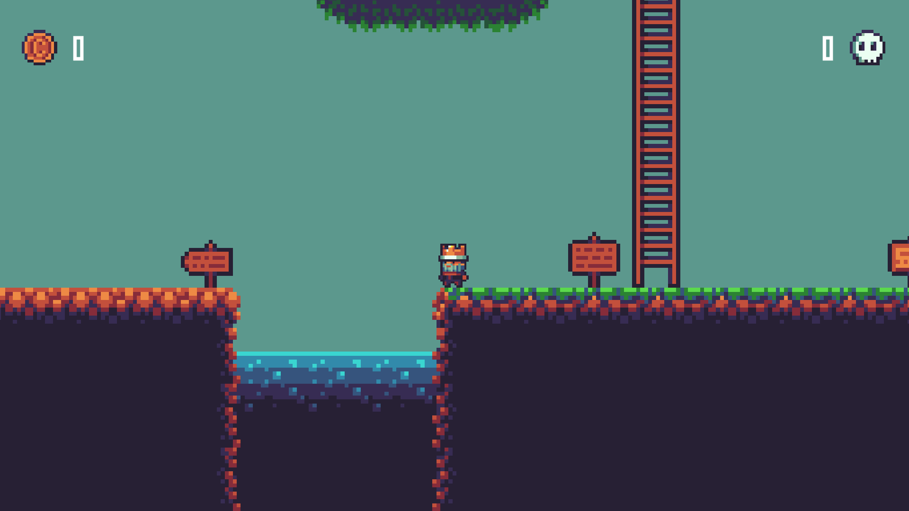
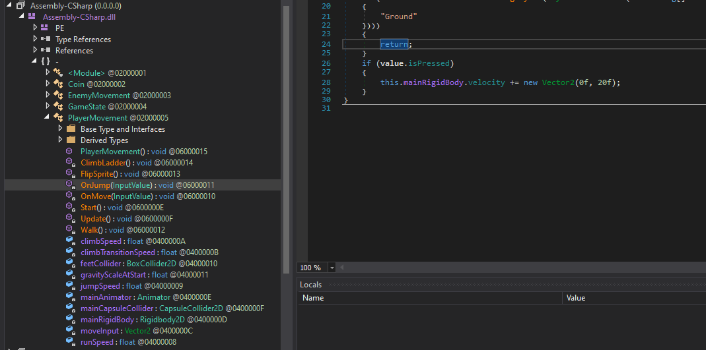
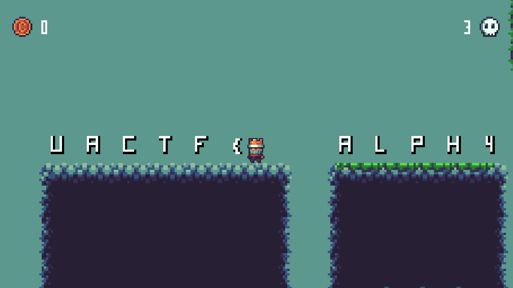
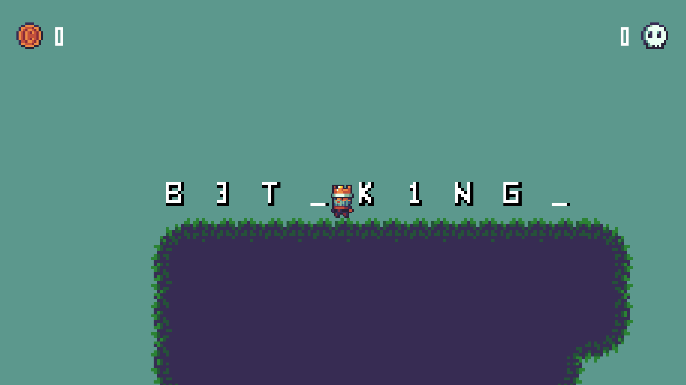
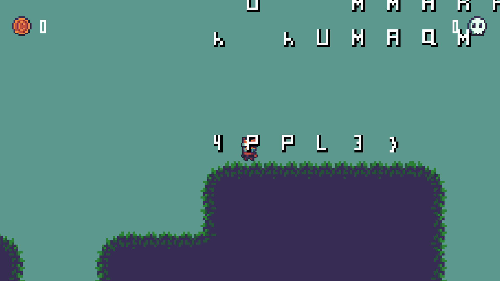

One of my favorite challenges in this contest. We are given a 2-d platformer game made with Unity. Amazing.

On opening the game, we see a Mario like platformer game, but we are unable to cross the cliff and reach the other end. Our jump velocity is not sufficient to cross the gap.

They have shared the entire game files with us. So with some googling, I was able to find a open source tool called DnSpy to view the source code of .dll files.

The main .dll file containing the game and character mechanics is under Managed folder in the Assembly-CSharp.dll.

Here we can see all sorts of important game mechanics like jump speed, walk speed, on jump, on move and more.

I went to the on jump function and hardcoded the velocity vector to 20f. After I saved the project in DnSpy and recompiled it, I was able to jump much higher than before.

Using this new boost cheat, I was able to cross the cliff and the flag was scattered in the other islands.

