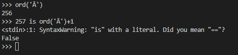

The challenge opens a netcat shell and asks us for a input character. An IF condition is checked using the entered input and a funciton called "unreachable" is used to print the flag.

On first glance, the IF block seems to be impossible to bypass.

```
n = int(input('Please input a number: '))
c = input('Please input a character: ')[0]

if n is ord(c) and n+1 is not ord(c) + 1:
    unreachable()
```

After some googling, I was able to find [this blog](https://betterprogramming.pub/python-a-snake-that-loves-objects-e3c566a45cf5) which has a detailed explaination on "IS" comparison in python and object allocation. 

Essentially, Python has a pre-allocated objects assigned for integers ranging from -5 to 257. So IS comparison for all these ints will return true however, for ints with range more than that IS comparison will fail.

I tested this out by using the character "Ā" whose ord is 256.



As expected, the comparison failed.

So I gave this character and 256 as input to the netcat shell and I was able to retrive the flag.

flag is ```UACTF{n07_411_5n4k35_423_8u117_3qu41_45_d3m0n572473d_8y_15_4nd_3qu415}```