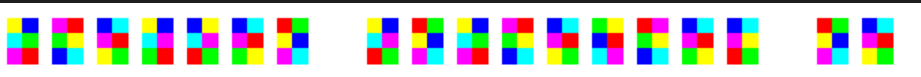
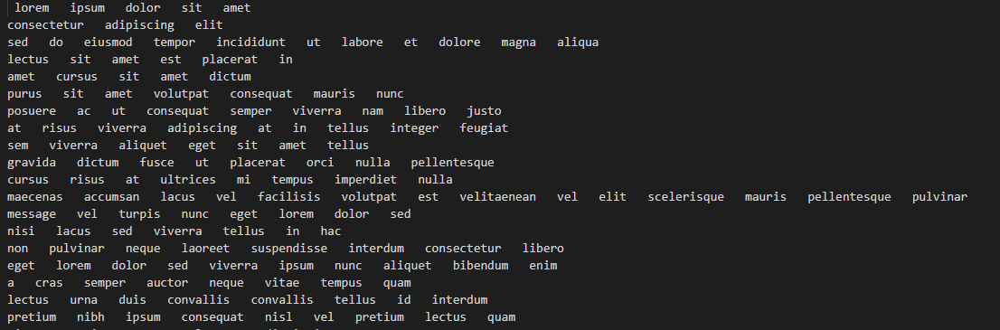
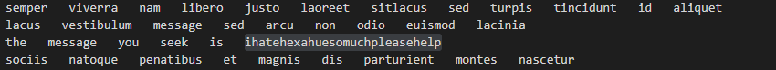

This challenge was titled "I hate hexahue" and rightly so.

We are given an image of dimensions 111340*50. That is a pretty long image. Here is a small segment of what is in it.



On googling what hexahue is, we can find out that it is a kind of encryption where every character is represented as 6 blocks of specific colors (white, black, red, lime, blue,yellow, cyan, magenta, gray)

Now that we know what the encryption is, we know what to do next. Parse the pixels in the given image to get each individual "hexa-block" and assign it to its corresponding character.

Fortunately, the internet is a wonderful place, and I was able to find a github repo which parses hexahue inputs.

Unfortunately, the ctf decided to test my sanity and gave an input image for which I had to adjust paddings and pixel dimensions for the repo to work it's magic. I did not have the patience nor the mental stability to do that, so I decided to write a simple hexahue parser of my own specific to this particular image.

One silver lining was that I could re-use the map of hexa-color-blocks to the characters from the repo.

```
hexahue[(magenta, red, lime, yellow, blue, cyan)] = 'a'
hexahue[(red, magenta, lime, yellow, blue, cyan)] = 'b'
hexahue[(red, lime, magenta, yellow, blue, cyan)] = 'c'
hexahue[(red, lime, yellow, magenta, blue, cyan)] = 'd'
hexahue[(red, lime, yellow, blue, magenta, cyan)] = 'e'
hexahue[(red, lime, yellow, blue, cyan, magenta)] = 'f'
hexahue[(lime, red, yellow, blue, cyan, magenta)] = 'g'
.
.
.
.
.
hexahue[(white, black, gray, white, black, gray)] = '8'
hexahue[(black, white, gray, white, black, gray)] = '9'
```

Now that I have this, I parsed through every blocks in the given image and wrote a simple logic to find individual 6 colored blocks and find the corresponding ascii character from the map. I have attached the code in soln.py.

This gave a huge text file and big surprise, it was a LOREM IPSUM.

I had to tweak the resulting file a bit by removing unnecessary white spaces and add line breaks to make it legible. So after few more minutes of mental torture, I was able to get a text file that looked like this.



After scrolling through this a bit, I was able to find the flag:



Flag is vsctf{ihatehexahuesomuchpleasehelp}

Could not relate more to the flag.


